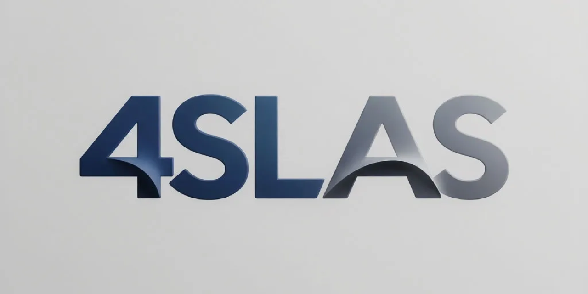

# 4SLAS CMS

  

  
  
  

> ⚠️ Это альфа-версия. Возможны ошибки и неточности.

**Бесплатная (MIT), самодостаточная и безопасная CMS для блога на PHP 8**

Никаких фреймворков, подписок и CDN. Всё своё — от WYSIWYG-редактора до двойного OAuth.

---

## Возможности

- **[4SLASeditor](https://github.com/time404rm/4SLASeditor)** — собственный WYSIWYG-редактор на `contenteditable`, 1600+ строк чистого JS, 30+ кнопок, 0 зависимостей
- **Фронтенд-редактор** — редактирование постов и страниц прямо на сайте (`?edit=1`), контекстное меню по правому клику (форматирование, ссылки, изображения, код, cut), SEO-поля, автсохранение черновика
- **GrapesJS** — визуальный билдер для страниц (drag & drop)
- **Float-bar** — стеклянная боковая панель с иконками и выезжающими панелями
- **AI-генерация SEO** — автоматическая генерация meta-тегов через ИИ
- **AI-перелинковка** — умная расстановка ссылок между статьями
- **Двойной OAuth 2.0** — вход через Яндекс ID и VK ID (без пароля)
- **Security-first** — Argon2ID, CSRF на каждую форму, rate limiting, honeypot, гибридная капча
- **Полный SEO-пакет** — ЧПУ, sitemap.xml, robots.txt, RSS, JSON-LD разметка, Open Graph, Yandex Metrika
- **WYSIWYG + HTML** — визуальный редактор и прямой ввод HTML
- **Свои страницы** — создание страниц помимо постов
- **Меню** — настраиваемое меню через админку
- **Галерея** — загрузка и вставка изображений в редакторе
- **Markdown-импорт** — вставка Markdown с фронтматером (title, author, date, tags, slug, canonical)
- **MIT лицензия** — можно использовать, менять, продавать — без ограничений

## Требования

- PHP 8.0+
- MariaDB 10+ / MySQL 5.7+
- Apache с mod_rewrite
- Расширения PHP: `pdo_mysql`, `gd`, `mbstring`, `json`, `session`, `curl`

## Быстрая установка

1. Скачайте и распакуйте архив в корень веб-сервера
2. Создайте базу данных MySQL/MariaDB
3. Откройте сайт в браузере — запустится веб-установщик
4. Заполните данные подключения к БД и настройки администратора
5. Готово. Войдите в админку.

Установщик сам создаст таблицы и базовую конфигурацию.

## OAuth

1. Зайдите в настройки админки
2. Введите Client ID и Client Secret от Яндекс ID / VK ID
3. Кнопки входа появятся на страницах логина, регистрации и в боковой панели

## Редактор

Подробное описание 4SLASeditor — в [docs/editor-article.md](docs/editor-article.md).

## Безопасность

- Пароли — Argon2ID (или bcrypt, если сервер не поддерживает Argon2)
- CSRF-токены на каждой форме (админка, установка, комментарии)
- Rate limiting на логин и восстановление пароля
- Honeypot + капча на регистрацию и комментарии
- XSS-защита — все выводы через `htmlspecialchars()`
- SQL-инъекции — параметризованные запросы через PDO
- Защита загрузок — whitelist расширений, проверка MIME

## Лицензия

MIT — свободно используйте, изменяйте и распространяйте.

---

**Разработчик:** [ruslanabuzyaroff](https://github.com/time404rm)
**Сайт:** [time404.ru](https://time404.ru)
